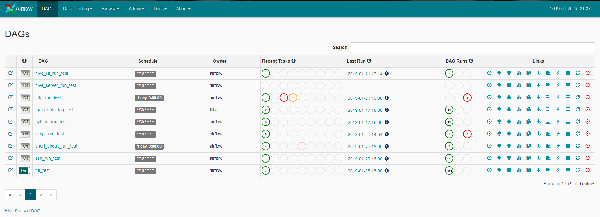

# airflow 1.10.1 简述及实例(ssh_script_hive_main_sub)
## 概述
- 参考
    - https://github.com/apache/airflow
    - https://www.jianshu.com/p/e878bbc9ead2 浅谈调度工具——Airflow
    - https://www.jianshu.com/p/4ae1faea733b 开源数据流管道-Luigi vs Azkaban vs Oozie vs Airflow
    - https://blog.csdn.net/sxf_123456/article/details/79556023 airflow cron定时详解
    - https://blog.csdn.net/u012965373/article/details/72878491 Airflow学习笔记 --- 基本知识储备
## 结果示例

## 安装(采坑)
- 最好利用conda进行安装
    - 参看linux下Anaconda的安装 https://blog.csdn.net/qq1483661204/article/details/78201451
- 官网 https://airflow.apache.org/start.html
- 修改时区信息
    - 参看 https://blog.csdn.net/Crazy__Hope/article/details/83688986
    - 按照上面方式修改后,至少在web-ui上时区是正常的,但是数据库的时间还是存在8小时的时差的,不过不影响正常的任务调度,只是看着奇奇怪怪的
- 常用配置信息
    - 官网 https://airflow.apache.org/howto/set-config.html
    - 这个是1.8的,有一定参考意义 https://juejin.im/post/5b0d01cef265da08e84acc91
- 安装其他模块(最好安装下,减少后续使用其他模块出现依赖错误之类的(ssh已采坑))
    - pip install apache-airflow[all]
- 缺失mysql libmysqlclient.so.20
    - https://www.cndba.cn/leo1990/article/2729
    - 利用软连接即可 ln -s /usr/local/mysql/lib/libmysqlclient.so.20 /usr/lib64/libmysqlclient.so.20
## 示例Code以及操作
### 示例操作
- airflow -h/version
    - 查看帮助,记住这个就好了
    - 其参数解析,可作为源码参考
```
 parser = CLIFactory.get_parser()
    args = parser.parse_args()
    args.func(args)
```
- airflow list_dags
    - 列出集群的dag
- airflow list_tasks ssh_run_test
    - 列出ssh_run_test dag的任务
- airflow test ssh_run_test print_date 20190121
    - 测试ssh_run_test dag中的print_date任务示例
- airflow test ssh_run_test ssh_run_script 20190121
    - 测试ssh_run_test dag中的ssh_run_script任务示例
- airflow backfill ssh_run_test -s 20190120 -e 20190121
    - 测试ssh_run_test dag在指定时间内的任务调度
### 示例Code(https://github.com/undergrowthlinear/learn_python/tree/master/test/practice/airflow/example)
- 常用operator简介,参看 https://www.jianshu.com/p/6f5e1447c8fb
- 对于LocalExecutor方式,在airflow.cfg的同级建立dags目录,将相关py文件方式在其目录下
    - python dags/python_run_test.py 即可提交调度,然后使用上面的命令进行测试 
- script_run_test.py
    - 脚本的命令,注意最后的空格,必须要保留,如果使用Jinja template,最后的空格则不用,airflow机制如此(空格其实是用于转义)
- python_run_test.py
    - 支持python函数的回调
- main_sub_dag_test.py
    - 支持父子不同dag内嵌
- ssh_run_test.py
    - 需指定conn_id,在web界面的admin/connections下面进行配置
- hive_cli_run_test.py
    - hive_cli_conn_id在web界面的admin/connections下面进行配置,同时本地需有hive-cli支持
- hive_server_run_test.py
    - hive_cli_conn_id在web界面的admin/connections下面进行配置,使用jdbc进行连接hive-server
    - 支持队列设置(mapred_queue)/参数传递(hiveconfs)/数据库设定(schema)/hql文件支持
- short_circuit_run_test.py