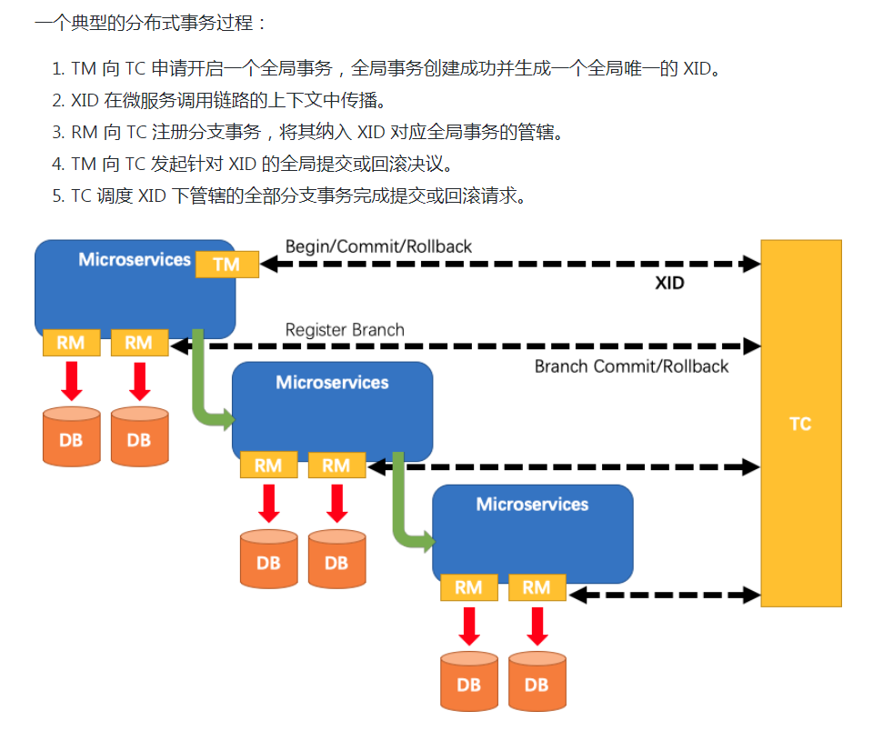
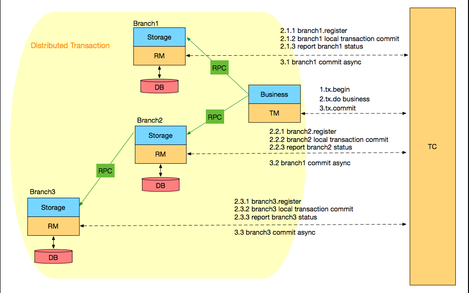

# alibaba fescar 0.2.1 简述及原理
## 概述
- 参考
- https://github.com/alibaba/fescar  ----官网
- https://github.com/alibaba/fescar/wiki/%E6%A6%82%E8%A7%88           ----概览简述
- https://github.com/fescar-group/fescar-samples dubbo/spring boot示例
- http://www.cnblogs.com/DKSL/p/fescar.html Spring Boot微服务如何集成fescar解决分布式事务问题
- 简述
    - fescar分布式事务组件,对于比之前的tcc/xa方案,0侵入性和高性能无疑是其2个月之内收获5000+star的原因之一,大厂出品效果确实不一般
### 官方文档
- 
- 事务协调器(tc)----维护全局事务的运行状态，负责协调并驱动全局事务的提交或回滚
- 事务管理器(tm)----控制全局事务的边界，负责开启一个全局事务，并最终发起全局提交或全局回滚的决议
- 资源管理器(rm)---- 控制分支事务，负责分支注册、状态汇报，并接收事务协调器的指令，驱动分支（本地）事务的提交和回滚
- 详细的数据流-下图2
- 
- 期待生产环境v0.5.x版本发布
    - cloud的支持/tcc的适配/动态配置发现/事务协调器的高可用    
### 模块划分与核心Code
- fercar-server(事务协调器相关支持)
    - com.alibaba.fescar.server.Server tc的启动类,接收port和存储session的dataDir参数
        - eg: sh fescar-server.sh 8091 /home/admin/fescar/data/
     - com.alibaba.fescar.server.coordinator.DefaultCoordinator tm与tc/rm与tc交互过程的相关支持
        - tm到tc doGlobalBegin(开启全局事务,返回xid)/doGlobalCommit(全局事务提交)/doGlobalRollback(全局事务回滚)
        - rm到tc doBranchRegister(分支注册)/doBranchReport(分支状态上报)/doLockCheck(分支查询全局锁情况) tc到rm branchCommit(让rm二阶段提交,即异步删除undo_log)/branchRollback(让rm二阶段回滚,通过undo_log回滚)
    - com.alibaba.fescar.server.lock.DefaultLockManagerImpl acquireLock全局锁的获取与支持(resourceId+tableName+pk.hashCode())
- fescar-tm
    - com.alibaba.fescar.tm.api.GlobalTransaction(DefaultGlobalTransaction) 全局事务相关信息
    - com.alibaba.fescar.tm.api.GlobalTransactionContext 全局事务上下文支持(依赖RootContext#getXID的ThreadLocalContextCore的ThreadLocal存储的map支持)
    - com.alibaba.fescar.core.model.TransactionManager(DefaultTransactionManager) 单例的事务管理器支持
    - com.alibaba.fescar.tm.TMClient tm与tc的netty通信封装
    - com.alibaba.fescar.tm.api.TransactionalTemplate 事务执行的模板,事务的流程在此控制()
        - GlobalTransaction tx = GlobalTransactionContext.getCurrentOrCreate() 创建新事务
        - tx.begin(business.timeout(), business.name()) 开始新事务,向tc获取xid,并绑定在上下文信息(RootContext.bind(xid))
        - rs = business.execute(); 执行业务逻辑
        - tx.rollback(); 通知tc回滚,消除xid绑定
        - tx.commit();   通知tc提交,消除xid绑定
- fescar-rm-datasource
    - com.alibaba.fescar.rm.datasource.DataSourceProxy 数据源代理
    - com.alibaba.fescar.rm.datasource.ConnectionProxy 连接代理
    - com.alibaba.fescar.rm.datasource.StatementProxy
        - 以执行更新操作为例,大致数据流如下,com.alibaba.fescar.rm.datasource.StatementProxy#executeUpdate
            - 委托com.alibaba.fescar.rm.datasource.exec.ExecuteTemplate#execute根据SQLType选择相应的执行器执行不同逻辑
            - com.alibaba.fescar.rm.datasource.exec.AbstractDMLBaseExecutor#executeAutoCommitFalse(进行beforeImage execute afterImage三步操作同时prepareUndoLog添加undo_log)
            - com.alibaba.fescar.rm.datasource.ConnectionProxy#commit(会flushUndoLogs commit report 刷新undo_log到数据库,提交本地业务事务,给tc上报状态信息)
    - com.alibaba.fescar.rm.datasource.PreparedStatementProxy
    - com.alibaba.fescar.rm.datasource.exec.Executor(各种执行器支持/delete_update_insert)
        - com.alibaba.fescar.rm.datasource.exec.AbstractDMLBaseExecutor 提供beforeImage和afterImage相关机制支持
    - com.alibaba.fescar.rm.datasource.undo.UndoLogManager(删除deleteUndoLog flushUndoLogs等支持)
    - com.alibaba.fescar.rm.datasource.undo.SQLUndoLog(undo_log相关信息记录)
- fescar-spring
    - com.alibaba.fescar.spring.annotation.GlobalTransactional 业务注解的入口支持
    - com.alibaba.fescar.spring.annotation.GlobalTransactionalInterceptor 切面的业务拦截,委托给transactionalTemplate.execute执行
    - com.alibaba.fescar.spring.annotation.GlobalTransactionScanner tm与rm客户端的相关初始化
- fescar-dubbo
    - com.alibaba.fescar.dubbo.TransactionPropagationFilter dubbo的上下文过滤支持,传递xid
### 示例
- fescar-samples-springboot示例,创建好库表,修改配置文件后,还需修改pom,添加如下依赖解决(https://blog.csdn.net/qq616138361/article/details/83512123)DubboLogo问题
```
<dependency>
			<artifactId>dubbo</artifactId>
			<groupId>com.alibaba</groupId>
			<version>2.6.0</version>
		</dependency>
```
- https://github.com/fescar-group/fescar-samples
            
