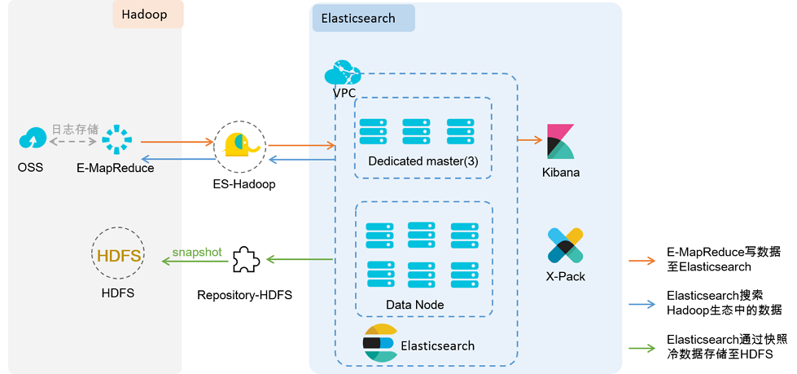

# elasticsearch 5.2.2 学习笔记之源码阅读13-应用与组件
# 背景
## 简述
- 关系型数据库与es对比

- es是基于lucene的分布式全文搜索引擎,es集群由多个节点(node)组成,每一个节点上管理多个索引(index)分片,每一个索引可包含多个类型(type)用于区分不同类型的数据,每一个类型都包含多行的文档(document),每一行文档可包含多个字段(field)
- es提供丰富的rest api供我们进行索引/查询/管理集群等等,后续均已rest接口与es集群进行交互
## 工具
- 测服es集群 http://127.0.0.1:9200,http://127.0.0.1:9201
- 提交rest请求工具 postman 
- 使用如下操作前,先安装插件 https://github.com/undergrowthlinear/elasticsearch-analysis-ik-custom 到es的plugins中
# REST展示
## 索引数据
- 创建设置索引信息
    - postman put http://127.0.0.1:9200/test.hello.es
    - application/json方式
```
{
  "index": {
    "analysis": {
      "analyzer": {
        "by_synonym_smart": {
          "type": "custom",
          "tokenizer": "ik_smart",
          "filter": ["by_tfr","remote_synonym"],
          "char_filter": [
            "by_cfr"
          ]
        },
        "by_synonym_max_word": {
          "type": "custom",
          "tokenizer": "ik_max_word",
          "filter": ["by_tfr","remote_synonym"],
          "char_filter": [
            "by_cfr"
          ]
        }
      },
      "filter": {
        "by_tfr": {
          "type": "stop",
          "stopwords": [" "]
        },
        "remote_synonym": {
          "type" : "dynamic_synonym",
          "synonyms_path" : "可以访问的同义词路径",
        "interval": 21600
        }
      },
      "char_filter": {
        "by_cfr": {
          "type": "mapping",
          "mappings": ["| => |","- => "]
        }
      }
    }
  }
}
```
- 查询索引信息
    - postman get http://127.0.0.1:9200/test.hello.es
- 设置索引类型的映射信息
    - postman put http://127.0.0.1:9200/test.hello.es/hello/_mapping
```
{
    	"properties": { 
        "mesg":    { "type": "text","analyzer":"by_synonym_smart"  }, 
        "user":     { "type": "text"  }, 
        "date":      { "type": "integer" }  
      }
}
```
- 添加索引类型数据
    - postman post http://127.0.0.1:9200/test.hello.es/hello
```
{
"date" : 12345,
"user" : "chenlin7",
"mesg" : "好好学习,天天向上,Elasticsearch,first message into Elasticsearch"
}
```
- 删除索引
    - postman delete http://127.0.0.1:9200/test.hello.es
## 查询数据
- 使用索引设置的分析器解析分析数据
    - postman get http://127.0.0.1:9200/test.hello.es/_analyze?text=好好学习&analyzer=by_synonym_smart
```
{
    "tokens": [
        {
            "token": "好好学习",
            "start_offset": 0,
            "end_offset": 4,
            "type": "CN_WORD",
            "position": 0
        }
    ]
}
```
- 
    - postman get http://127.0.0.1:9200/test.hello.es/_analyze?text=好好学习&analyzer=standard
```
{
    "tokens": [
        {
            "token": "好",
            "start_offset": 0,
            "end_offset": 1,
            "type": "<IDEOGRAPHIC>",
            "position": 0
        },
        {
            "token": "好",
            "start_offset": 1,
            "end_offset": 2,
            "type": "<IDEOGRAPHIC>",
            "position": 1
        },
        {
            "token": "学",
            "start_offset": 2,
            "end_offset": 3,
            "type": "<IDEOGRAPHIC>",
            "position": 2
        },
        {
            "token": "习",
            "start_offset": 3,
            "end_offset": 4,
            "type": "<IDEOGRAPHIC>",
            "position": 3
        }
    ]
}
```
- query_string查询
    - postman post http://127.0.0.1:9200/test.hello.es/hello/_search
```
{
    "query": {
        "query_string": {
            "query": "Elasticsearch"
        }
    }
}
```
# 搜索应用
## 索引方面
- 词库处理
    - 解析搜狗词库
        - https://github.com/studyzy/imewlconverter
    - 搜集特定领域词汇汇集成专有词库
- 分词方式(目前采用的是IKAnalyzer+同义词)
    - 基于词库的智能分词/同义词智能分词
    - 基于词库的最多分词/同义词最多分词
        - https://github.com/undergrowthlinear/elasticsearch-analysis-ik-custom
- 常用分词方式对比
    - https://github.com/ysc/cws_evaluation
## 搜索策略方面
- 同义词维护
    - 部分名称采用同义词方式维护,进行查询
- 别称维护
    - 部分名称采用别称方式维护,进行查询
- 搜索方式
    - 多字段组合匹配
    - 自定义评分搜索 postman post http://127.0.0.1:9200/test.hello.es/hello/_search
```
{
    "query": {
        "bool": {
            "must": {
"function_score": 
                {
    "query": {
        "query_string": {
            "fields": [
                "mesg"
            ],
            "query": "Elasticsearch",
            "analyze_wildcard": true
        }
    },
    "functions": [
        {
            "exp": {
                "date": {
                    "origin": "1538128202568",
                    "offset": "15768000000",
                    "scale": "1",
                    "decay": 0.5
                }
            },
            "weight": 15
        }
    ],
    "score_mode": "sum"
}            },
            "must": {
                "query_string": {
                    "query": "user:chen*"                }
            }
        }
    },
    "highlight": {
        "pre_tags" : ["<test>"],
        "post_tags" : ["</test>"],
        "fields" : {
"mesg":{}        }                    },
    "from": 0,
    "size": 15,
     "sort": ["_score"]
    }
}
```
- 排序方式
    - 自定义排序需要根据各自业务进行相关的优化,例如我们的文章相关
        - 文章排序(以半年时间维度精选衰减,时间 15% + 阅读量 10% + 评论数 10%)
        - 其实这里想要更细化的控制,可以使用script去做也是类似的
# ELK组件
## 通用平台

## 公司内部elk与hadoop
- 
## elasticsearch 架构

### elasticsearch学习三重境
- 学习es 索引/分词/搜索/集群状态 rest api
    - https://www.elastic.co/guide/en/elasticsearch/reference/5.2/getting-started.html 官网参考
- 学习lucene 索引/分词/搜索 java api 
    - https://lucene.apache.org/core/7_4_0/demo/overview-summary.html#overview.description 官网demo演示
- 学习luke确定索引与搜索结果
    - https://github.com/DmitryKey/luke
    - Luke is the GUI tool for introspecting your Lucene / Solr / Elasticsearch index
# 应用对接
## java cloud 接入
- 这里我们是对jest进行了相关的封装
    - https://github.com/searchbox-io/Jest/tree/master/jest
# 大数据相关
- 
- 目前大数据平台使用es-hadoop从es获取相关业务的完整业务数据
# 参考
- https://www.elastic.co/guide/en/elasticsearch/reference/5.2/getting-started.html 官网参考
- https://blog.csdn.net/varyall/article/details/79143796 谈谈Elasticsearch 和 传统关系型数据库的对比
- http://www.ruanyifeng.com/blog/2017/08/elasticsearch.html 全文搜索引擎 Elasticsearch 入门教程
- http://www.cnblogs.com/binyue/p/6694098.html ELK统一日志系统的应用
- https://help.aliyun.com/document_detail/84595.html 解决方案架构与核心产品
- https://blog.csdn.net/kobejayandy/article/details/80792954 ElasticSearch入门简介


