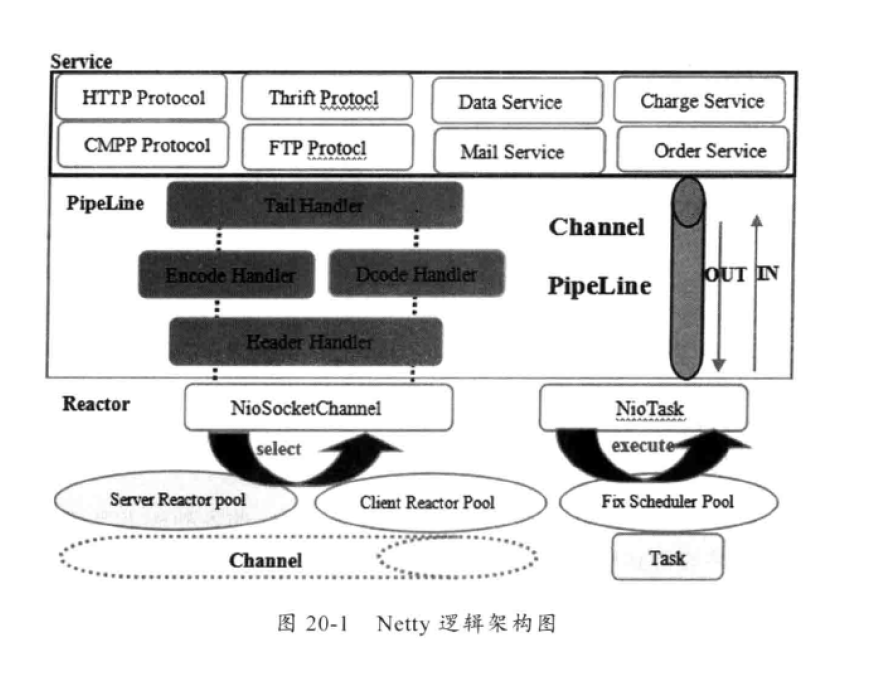
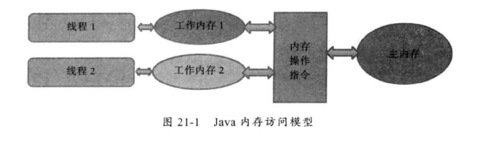

# netty 4.1.34 源码浅析1
## 概述
- 参考
    - https://netty.io/wiki/user-guide-for-4.x.html
    - https://github.com/netty/netty
    - https://www.infoq.cn/article/netty-threading-model#mainLogin
    - netty权威指南(第二版)
## 背景知识

- 单线程、多线程、线程池
    - 单线程Reactor(Acceptor+IO Handler/性能、安全、可靠都存在问题)
    - 多线程Reactor(Acceptor+IO Pool/当Acceptor需要鉴权,认证有很大损耗)
    - 主从Reactor(Accept Pool+IO Pool)
        - 一个Acceptor接收后,其他Acceptor负责鉴权/认证等,处理后将其注册到IO多路复用器,进行IO的读写
- 时间轮(tickMs/whileSize/Interval/currentTime+分层) 
- web协议变更(减少加载时间与增加安全性)
    - http1.0/http1.1/https/spdy(speedy)/http2 
    - ocsp(online certificate status protocol)
- Unix I/O模型
    - 阻塞IO(进程被阻塞)
    - 非阻塞IO(轮询查内核数据,进程非阻塞)
    - IO复用型(通过注册fd到select/epoll系统调用,内核态感知fd准备好,则回调用户态进行数据复制)
        - epoll相比与select,fd无限制(select=1024/epoll=>1GB=10万个)
        - io效率不会随着fd的增加而线性下降(epoll使用活跃socket的回调,不会像select扫描所有socket列表,但是活跃的socket太多,效率就差不多)
        - epoll使用mmap同一块内存共享内核与用户空间,无需消息在两个空间的复制
        - epoll的api更简单
    - 信号驱动IO模型(通过信号量通知应用,进行数据的内核态到用户态的复制)
    - 异步IO(在内核态完成数据复制操作,应用只需处理业务逻辑)
- java IO模型
    - BIO(通过线程池策略(伪异步)处理每一个socket,ServerSocket监听/Socket连接)
    - NIO(ByteBuffer进行数据缓冲,使用Channel进行数据传输,利用Selector进行通道的轮询与管理,读写均是异步的)
    - AIO(NIO的升级版,通过一系列的回调策略(CompletionHandler)完成应用功能,无需借助于Selector,对应于unix的异步IO)
- Netty好处
    - api使用简单,二次开发门槛低
    - 功能强大,多种预置编解码器
    - 定制能力强,通过ChannelHandler进行二次扩展
    - 成熟、稳定、性能高、社区活跃
    - 零拷贝(堆外直接内存进行Socket读写)
- TCP的粘拆包
    - 不同的数据包粘到一起,称之为粘包
    - 同一数据包分多次传递,则称之为被拆包
    - 可发生在TCP(套接字的缓冲区大小限制)/IP(MaxTUnit)/数据链路层(payload)
- java序列化的劣势
    - 无法跨语言
    - 序列化后的码流太大
    - 序列化性能太低
    - 可以选择Google的PB/Apache的Thrift/Jboss的Marshalling
- java内存模型
    - 所有变量在主内存和线程的工作内存之间进行数据的传递 

## 源码阅读问题
- ChannelHandlerContext是如何传递共享参数的?
    - 上下文数据通过委托给Channel携带(channel().attr(key)),因为Channel和ChannelHandlerContext都继承了AttributeMap,DelegatingChannelHandlerContext中采用委托方式
- 在解析http协议时,为什么会有HttpRequest/HttpContent/LastHttpContent这几个对象产生?
    - 主要是通过HttpObjectDecoder(解析ByteBuf为HttpMessage和HttpContent或者LastHttpContent,取决于内容数据块的长度;如果没有内容,则是createMessage创建HttpMessage的子类;如果有固定长度内容,且小于maxChunkSize,则DefaultLastHttpContent;最后有很多内容的时候,就是DefaultHttpContent、DefaultLastHttpContent)----所以这里有HttpRequest和HttpContent内容需要业务端分开处理   
    - 同时在上面HttpObjectDecoder解析层的父类,有更进一步的解析,io.netty.handler.codec.ByteToMessageDecoder#fireChannelRead----将解析出来的列表元素循环迭代对后续的处理器,对于理解http的HttpRequest与HttpContent/LastHttpContent至关重要  
## 核心Code
### Nio相关与netty相近
- nio相关概念可参看 
    - https://blog.csdn.net/undergrowth/article/details/46363827
    - https://blog.csdn.net/undergrowth/article/details/46419473
- Channel(通道IO操作)
    - read, write, connect, and bind
    - asynchronous/
    - ServerSocketChannel/ServerChannel/NioServerSocketChannel
    - 上下文数据委托给Channel携带(channel().attr(key))
- Selector(IO多路复用器)
- ByteBuffer/ByteBuf
    - ByteBuf为netty封装的缓冲区,主要是(0<=readerIndex<=writerIndex<=capacity)进行数据的读写 
- Unsafe
### netty特有
- Bootstrap、ServerBootstrap (引导类)
- EventLoop(处理注册Channel相关的io操作)
    - NioEventLoop/NioEventLoopGroup(线程池) (线程和任务队列,支持任务运行)
    - NioEventLoop管理Channel和Selector 
- ChannelHandler(无锁化的串行化设计)/ChannelPipeline(拦截过滤器模式)
    - ChannelInboundHandler/ChannelOutboundHandler 
    - ChannelInboundHandlerAdapter/ChannelOutboundHandlerAdapter/ChannelDuplexHandler
    - ChannelHandlerContext(AttributeKey传递管道在多个处理器之间的共享信息)
    - ChannelPipeline(Socket.read()---->Channel Chain/Channel Chain---->Socket.write())
        - DefaultChannelPipeline 
- Future(异步操作的结果) 
### netty常用编解码
- ChannelInboundHandlerAdapter(通过上下文前向传递到下一个ChannelHandler)
    - ChannelInitializer(为Channel的管道添加处理器/channelRegistered/handlerAdded 调用initChannel) 
    - ByteToMessageDecoder(将ByteBuf转为Message Object)
        - LineBasedFrameDecoder(以\n或者\r\n作为分隔符,进行ByteBuf的转化)
        - DelimiterBasedFrameDecoder(将ByteBuf以分隔符的方式进行转化)
        - FixedLengthFrameDecoder(以frameLength为分隔,进行解析)
        - LengthFieldBasedFrameDecoder(以字段长度解析Byte,异常强大)
            - lengthFieldOffset/lengthFieldLength----(决定字段长度在哪里)
            - lengthAdjustment(内容长度=字段长度+长度调节值/因为字段长度可能只包含内容或者包含头信息或者字段长度的长度,所以长度调节值可正可负)
            - initialBytesToStrip(转换出来的内容是否要省略些信息,例如头部信息或者字段长度)
        - SnappyFrameDecoder(解码使用Snappy进行传输的ByteBuf) 
        - ObjectDecoder(利用LengthFieldBasedFrameDecoder进行传递)
    - MessageToMessageDecoder(将Message Object转为Message Object/acceptInboundMessage/decode)
        - StringDecoder(将ByteBuf转为String) 
        - Base64Decoder(将ByteBuf以Base64进行解码)
        - ProtobufDecoder
- ChannelOutboundHandlerAdapter(通过上下文前向传递到下一个ChannelHandler)
    - MessageToMessageEncoder
        - LineEncoder
        - StringEncoder
        - Base64Encoder
        - ProtobufEncoder(pb协议转换Message为ByteBuf)
    - MessageToByteEncoder
        - ObjectEncoder 
        - Bzip2Encoder(将ByteBuf使用Bzip2进行压缩)
        - SnappyFrameEncoder(将ByteBuf使用Snappy格式压缩)
### http协议支持
- HttpObject
    - HttpContent(大块对象支持) 
        - DefaultHttpContent
        - LastHttpContent(EMPTY_LAST_CONTENT)
    - HttpMessage(HttpRequest/HttpResponse的通用属性支持)
    - HttpRequest
        - DefaultHttpRequest 
- HttpObjectDecoder(解析ByteBuf为HttpMessage和HttpContent或者LastHttpContent,取决于内容数据块的长度;如果没有内容,则是createMessage创建HttpMessage的子类;如果有固定长度内容,且小于maxChunkSize,则DefaultLastHttpContent;最后有很多内容的时候,就是DefaultHttpContent、DefaultLastHttpContent)----所以这里有HttpRequest和HttpContent内容需要业务端分开处理
    - HttpRequestDecoder()
    - HttpResponseDecoder(解析ByteBuf为HttpResponse/HttpContent)
- HttpObjectEncoder(将HttpMessage或者HttpContent转换成ByteBuf)
    - HttpRequestEncoder(HttpRequest/HttpContent转为ByteBuf)
    - HttpResponseEncoder(HttpResponse/HttpContent转为ByteBuf)
- io.netty.handler.codec.ByteToMessageDecoder#fireChannelRead----将解析出来的列表元素循环迭代对后续的处理器,对于理解http的HttpRequest与HttpContent/LastHttpContent至关重要
## 测试
- https://github.com/netty/netty/tree/netty-4.1.34.Final/example/src/main/java/io/netty/example 官方源码例子
- https://github.com/undergrowthlinear/netty 自己总结相关测试代码